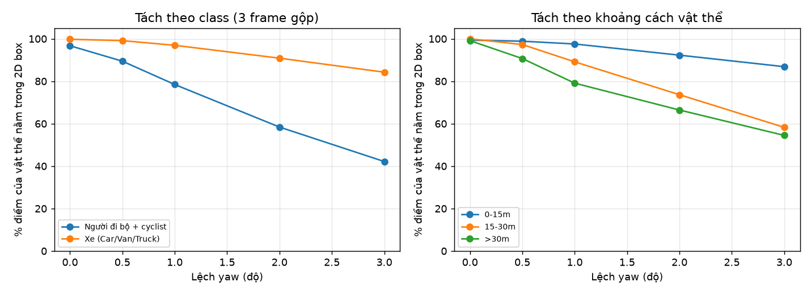
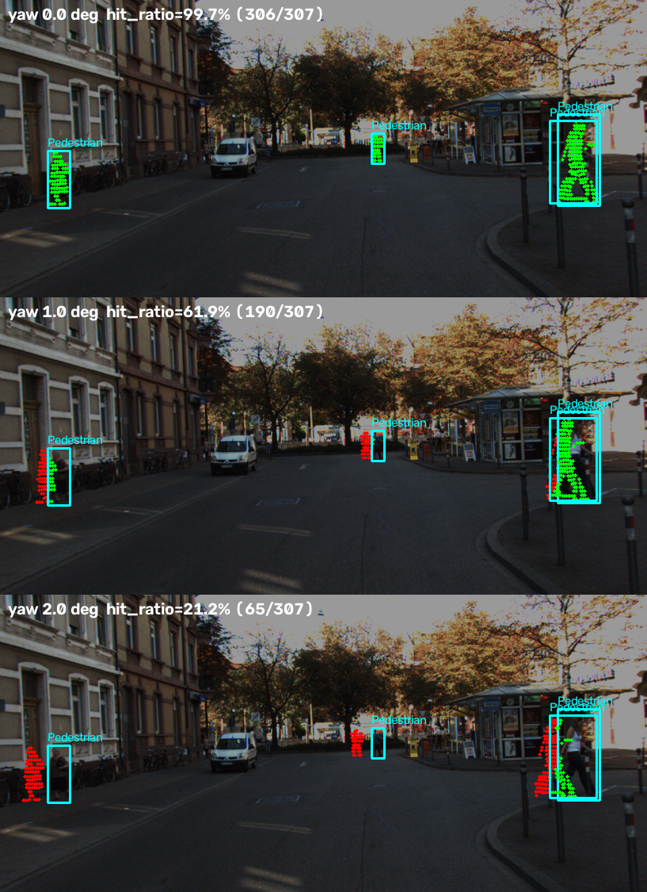

# Báo cáo Day 6: Phát hiện calibration LiDAR-camera bị lệch

- **Họ tên:** Hoàng Quốc Việt
- **MSSV:** 2A202602563
- **Lớp:** AI20K-T4
- **Link repo:** https://github.com/Catnip-harvest/HoangQuocViet-2A202602563-Track4-Day21
- **Topic:** A — LiDAR-camera projection QA (calibration)
- **Dataset:** data/kitti_mini (chính), data/nuscenes_mini_subset (so sánh, lỗi thời gian), data/synthetic (debug + tìm lỗi cài sẵn)
- **Các frame đã dùng:** 000008, 000011, 000049 (thí nghiệm chính); 000004, 000019 (demo khoảng cách); cả 20 frame KITTI và 80 keyframe nuScenes (so sánh metric, B5)

**Metric chính, `hit_ratio`:** lấy các điểm LiDAR nằm trong 3D box của label (xác định bằng calib gốc), chiếu chúng bằng calib cần kiểm tra, rồi đếm bao nhiêu % rơi đúng vào 2D box của vật đó. Calib đúng thì gần 100%. Code: `src/calib_qa.py`, hàm `object_hits_for_frame`.

## 1. Claim

**Claim cuối:** Lệch yaw 1° làm `hit_ratio` của người đi bộ + cyclist giảm **18.2 điểm %** (96.7% → 78.5%, gộp 3 frame 000008/000011/000049), gấp hơn 6 lần xe (99.8% → 96.9%, −2.9 điểm %). Ở frame nhiều người đi bộ 000011, mức giảm là 22.0 điểm % (99.5% → 77.4%).

- Claim nháp ở CP1 là "giảm hơn 20 điểm %". Số liệu **xác nhận một phần**: đúng ở frame 000011 (−22.0), nhưng khi gộp 3 frame chỉ là −18.2, vì frame 000008/000049 có ít người đi bộ.
- Hệ quả kiểm chứng trên cả 20 frame KITTI: ngưỡng `hit_ratio < 97%` cho mỗi frame bắt được 80% frame lệch 1° và 95% frame lệch 2°, với 5% báo nhầm ở 0° (1/20 frame, là 000048 có 92.0% do label 2D/3D không khớp).

## 2. Evidence

Mọi số dưới đây lấy từ `results/*.csv`, đã chạy lại lần 2 và so sánh byte-by-byte ra giống hệt (`filecmp`). Các phép ngẫu nhiên đều có `seed=0`.

**Script mẫu (đối chiếu đúng bảng của codelab):** `results/yaw_perturb_sweep.csv`, hình `results/figures/yaw_sweep.png`.

| yaw | 000008 (đông xe) | 000011 (nhiều người đi bộ) | 000049 (bị che) | số điểm trong ảnh, 000011 |
|---|---|---|---|---|
| 0° | 99.63% | 99.45% | 99.25% | 19 946 |
| 0.5° | 99.57% | 91.88% | 97.46% | 19 946 |
| 1° | 98.62% | 77.44% | 93.50% | 19 952 |
| 2° | 94.81% | 45.44% | 84.74% | 19 963 |
| 3° | 90.98% | 21.23% | 74.32% | 19 948 |

**Mở rộng 1: tách theo class và khoảng cách** (`results/yaw_sweep_detail_objects.csv`, hình `yaw_breakdown_class_range.png`):

| yaw | người đi bộ + cyclist | xe | 0–15 m | 15–30 m | > 30 m |
|---|---|---|---|---|---|
| 0° | 96.7% | 99.8% | 99.3% | 100.0% | 99.1% |
| 1° | 78.5% | 96.9% | 97.6% | 89.1% | 79.1% |
| 3° | 42.2% | 84.3% | 86.9% | 58.3% | 54.5% |

Vật hẹp và vật xa bị ảnh hưởng nặng nhất, đúng như lý thuyết: lệch góc dịch điểm khoảng `f·tanθ` ≈ 12.6 px ở **mọi** khoảng cách, còn box của người ở 30 m chỉ rộng khoảng 15–20 px.

**Mở rộng 2: so sánh 6 kiểu lệch** (`results/{yaw,pitch,roll,tx,ty,tz}_sweep*.csv`, hình `param_compare.png`), `hit_ratio` gộp 3 frame:

| Lệch | 0 | 0.5° / 2 cm | 1° / 5 cm | 2° / 10 cm | 3° |
|---|---|---|---|---|---|
| yaw | 99.5% | 98.1% | 95.0% | 87.4% | 79.7% |
| pitch | 99.5% | 97.6% | 94.4% | 84.1% | 72.0% |
| roll | 99.5% | 99.1% | 97.8% | 95.5% | 92.3% |
| tx / ty / tz | 99.5% | 99.4 / 99.4 / 99.5% | 99.4 / 99.3 / 98.7% | 99.3 / 98.9 / 95.2% | — |

Pitch nguy hiểm nhất vì box cao và hẹp theo chiều dọc rất ít, còn roll gần như vô hại ở gần tâm ảnh. Dịch 10 cm gần như không thấy được, trừ tz (dịch dọc): dịch tạo ra độ lệch `f·d/z`, nhỏ dần theo khoảng cách.

**Demo chạy thật:** overlay ở 3 khoảng cách: vật gần dưới 6 m `overlay_000019_…png`, nhiều người đi bộ `overlay_000011_…png`, xe xa trên 50 m `overlay_000004_…png`.




**[B1] So sánh 2 metric: `hit_ratio` (cần label) và `edge_score` (không cần label)**, trên cả 20 frame KITTI (`results/kitti_all_metrics.csv`, `results/metric_compare_auc.csv`, hình `metric_compare_hit_vs_edge.png`). `edge_score` là % "điểm mép" của LiDAR (điểm gần hơn điểm kề bên ít nhất 0.5 m) rơi cách cạnh Canny của ảnh không quá 3 px. AUC là xác suất một frame bị lệch có metric thấp hơn một frame sạch bất kỳ (0.5 nghĩa là đoán mò):

| yaw | AUC hit_ratio | AUC edge_score | % frame thấp hơn chính nó ở 0°: hit / edge |
|---|---|---|---|
| 0.5° | 0.887 | 0.589 | 95% / 90% |
| 1° | 0.963 | 0.620 | 100% / 100% |
| 2° | 0.990 | 0.660 | 100% / 95% |

- `hit_ratio` tốt hơn hẳn khi so với một **ngưỡng tuyệt đối**: các frame sạch nằm sát nhau (độ lệch chuẩn 1.8%). Nhược điểm: cần label 3D và 2D, nên chỉ dùng được offline hoặc khi có detector làm nguồn box.
- `edge_score` không cần label, nhưng mức nền của nó phụ thuộc cảnh (32% đến 76% ở 0°, độ lệch chuẩn 14.8%), nên ngưỡng tuyệt đối gần như vô dụng. Khi so với **chính frame đó ở 0°** thì nó vẫn giảm ở 100% frame lệch 1°, nên hợp để theo dõi xu hướng trên cùng một xe theo thời gian.
- Failure riêng của `edge_score`: trên nuScenes nó gần như phẳng (8.9% ở mọi mức yaw), vì LiDAR 32 beam thưa và thứ tự điểm trong file không còn là "2 tia kề nhau", nên bộ phát hiện điểm mép không hoạt động.

**[B2] Stress test suy giảm dữ liệu** (`results/degrade_dropout.csv`, `results/degrade_noise.csv`, hình `degradation_stress.png`), 3 frame, ở yaw 0° và 1°:

| Suy giảm | hit_ratio 0° | hit_ratio 1° | số điểm trên vật thể (0°) |
|---|---|---|---|
| giữ 100% / 70% / 50% / 30% điểm | 99.5 / 99.5 / 99.6 / 99.6% | 95.0 / 95.2 / 95.3 / 95.6% | 10 409 / 7 304 / 5 215 / 3 111 |
| nhiễu xyz 0 / 2 / 5 / 10 cm | 99.5 / 99.4 / 99.3 / 99.1% | 95.0 / 95.0 / 94.9 / 94.9% | 10 409 / 10 145 / 9 555 / 8 684 |

Vì là tỉ lệ, metric gần như không bị ảnh hưởng bởi dropout ngẫu nhiên và nhiễu tới 10 cm: khoảng cách 0° với 1° vẫn giữ khoảng 4 điểm %. Thứ mất đi là số điểm: giữ 30% thì còn 3 111 điểm trên vật thể, nên người đi bộ ở xa chỉ còn vài điểm và `hit_ratio` của từng vật trở nên rất nhiễu. Khi chạy thật phải gộp nhiều frame.

**[B3] Latency** (`results/latency.csv`, chạy bằng `python -m src.latency`, 21 lần, bỏ lần đầu, frame 000011, 108k điểm): `hit_ratio` p50 = **28.5 ms**, p95 = 30.0 ms; `edge_score` p50 = **12.0 ms**, p95 = 12.8 ms. Máy đo: AMD Ryzen 9 7940HS (8 nhân / 16 luồng), RAM 31.2 GB, chỉ dùng CPU, Python 3.13, NumPy 2.2.6, OpenCV 5.0.

**[B5] KITTI so với nuScenes** (`results/nusc_yaw_sweep.csv`, 80 keyframe; hình `kitti_vs_nuscenes.png`):

| yaw | KITTI (20 frame) | nuScenes scene-0103 (ngày) | nuScenes scene-1094 (đêm, mưa) |
|---|---|---|---|
| 0° | 99.6% | 99.9% | 100.0% |
| 0.5° | 97.9% | 98.4% | 98.6% |
| 1° | 94.2% | 93.9% | 94.2% |
| 2° | 86.6% | 83.9% | 84.5% |

- Tiêu cự nuScenes lớn hơn (1253 so với 721.5 px), nên cùng 1° thì điểm trượt 21.9 px thay vì 12.6 px. Nhưng box cũng to hơn theo đúng tỉ lệ `f`: tỉ số "độ trượt / độ rộng box" = `Z·tanθ / W` **không phụ thuộc f**. Vì vậy hai dataset cho đường cong gần trùng nhau.
- nuScenes giảm nhanh hơn một chút ở 2°, vì vật ở xa hơn (trung vị 31.6 m so với 23.6 m) và tỉ lệ người đi bộ cao hơn (371/1085 vật so với 18/113).
- Mức 0° của nuScenes gần 100%, vì 2D box ở đây được **sinh ra từ chính 3D box** bằng cùng calibration (`starter/nuscenes_io.py`), không phải người vẽ tay như KITTI. Mức sàn của metric vì thế không so trực tiếp được giữa 2 dataset (lớp Metric).
- LiDAR 32 beam thưa: trung vị chỉ 3 điểm trên mỗi vật, so với 113 ở KITTI. Ban đêm không làm thay đổi `hit_ratio`, vì metric chỉ dùng hình học, không dùng điểm ảnh.

**[B6] Lỗi cài sẵn trong `data/synthetic`** (`python -m src.find_synthetic_bugs` → `results/synthetic_bugs.csv`):

| Lỗi | Frame | Cách phát hiện (kèm số) |
|---|---|---|
| Điểm NaN trong point cloud (lớp I/O) | cả 5 frame | `np.isfinite`: 23/23 953 điểm (0.10%) mỗi frame; cột `invalid_ratio` trong `results/data_health.csv`. `cam_to_image` lọc chúng ở bước 1 |
| Timestamp ghi sai (lớp Time) | 000003 | `timestamps.txt` là 0.0, 0.1, 0.2, **0.4**, 0.5: dt 000002→000003 = 0.2 s, các cặp khác 0.1 s. Nhưng người đi bộ trong label đi đúng 2.00 m mỗi frame, kể cả cặp này, nên frame không bị rơi mà timestamp bị ghi sai (đúng ra là 0.3) |
| Một sector LiDAR bị thưa, như bị bùn che một phần (lớp I/O, sensor) | 000003 | Histogram azimuth theo ô 1°: vùng −40°…−5° (phía trước bên phải) chỉ có 704 điểm, so với trung vị 2 427 ở các frame khác (mất 71%). Frame có n = 22 063, thay vì khoảng 23 800. Quy tắc gốc `empty_az_bins` vẫn báo 0, vì sector chỉ thưa đi chứ không rỗng. Overlay `overlay_000003_…png` có 11.8% điểm trong ảnh, so với 16.3% ở 000000 |

## 3. Failure case



**Fail 1, lớp Geometry (calibration extrinsic).** Frame 000011, chỉ vẽ điểm thuộc người đi bộ (xanh lá là trong box, đỏ là rơi ra ngoài). `hit_ratio` của người đi bộ là 99.7% ở 0°, 61.9% ở 1° và 21.2% ở 2°. Lệch yaw dịch mọi điểm khoảng 12.6 px/độ sang ngang ở mọi khoảng cách, trong khi người đi bộ ở xa chỉ rộng 15–20 px. Vì vậy người ở xa (người ở giữa ảnh) rơi hẳn ra ngoài box ngay từ 1°, còn người ở gần (bên phải) vẫn giữ một phần. Nếu dùng kết quả này để gán điểm LiDAR cho box camera (fusion hoặc gán nhãn tự động), người đi bộ ở xa sẽ mất hết điểm, hoặc nhận nhầm điểm của tường phía sau. **Cách phát hiện khi chạy thật:** tính `hit_ratio` trên box của detector camera, chỉ lấy người đi bộ và cyclist (nhạy gấp khoảng 6 lần so với xe), rồi gộp theo cửa sổ thời gian.

**Fail 2, lớp Metric.** Metric "số điểm nằm trong ảnh" mù hoàn toàn trước drift: frame 000011 có 19 946 điểm ở 0° và 19 948 ở 3°, trong khi `hit_ratio` rơi từ 99.5% xuống 21.2% (`fail_03_metric_inside_image_blind.png`). Lệch yaw chỉ làm điểm trượt sang chỗ khác bên trong ảnh, nên số lượng gần như không đổi.

**Fail 3, lớp Time** (`fail_02_no_ego_motion_scene-1094_012.png`, `results/ego_motion.csv`). Trên nuScenes, camera chụp sớm hơn LiDAR trung bình 35.6 ms. Xe chạy khoảng 6–11 m/s nên đi được 0.3–0.4 m trong khoảng đó. Bỏ bù ego motion làm `hit_ratio` giảm tới 9.6 điểm % ở scene-1094_030 (100% → 90.4%). Trung bình chỉ giảm 0.3–1.2 điểm %, vì độ dịch 0.3 m là phép dịch, nên chỉ thấy rõ ở vật gần. Phát hiện bằng cách ghi log `|t_camera − t_lidar|` × tốc độ xe cho mỗi frame.

## 4. Khuyến nghị nếu triển khai thật

- **Use-case:** xe giao hàng tự hành trong đô thị, dưới 30 km/h, có camera trước và LiDAR trên nóc, chạy qua khu đông người đi bộ.
- **Cách làm:** mỗi khi xe dừng (đèn đỏ, giao hàng), tính `hit_ratio` trên box người đi bộ và cyclist của detector camera. Gộp theo cửa sổ 5 phút, cảnh báo "cần hiệu chỉnh lại" khi trung vị dưới **97%**. Theo mục 2, ngưỡng này bắt được 80% frame lệch 1° và 95% frame lệch 2° ngay từ một frame, với 5% báo nhầm. Gộp nhiều frame sẽ giảm báo nhầm. Song song, theo dõi `edge_score` so với giá trị của chính xe đó lúc vừa hiệu chỉnh xong (không cần box) để thấy drift dần dần.
- **Đánh đổi:** `hit_ratio` tốn khoảng 28.5 ms CPU mỗi frame (p50), không chạy nổi trên mọi frame ở 10 Hz cùng các module khác, nên chỉ chạy khi xe dừng hoặc 1 frame mỗi giây. Đổi lại, phát hiện chậm hơn vài phút. Metric phụ thuộc chất lượng detector: box sai sẽ trông giống calibration lệch. Pitch là kiểu lệch nguy hiểm nhất, nên ưu tiên kiểm tra theo chiều dọc.
- **Chỉ số cần ghi log:** `hit_ratio` theo từng class (người đi bộ, xe), số điểm trên mỗi vật (dưới 10 điểm thì bỏ, không tính), `edge_score`, lệch thời gian camera−LiDAR × tốc độ xe (cảnh báo khi > 0.2 m), số ô azimuth bị thưa so với trung bình 10 frame gần nhất (bắt lỗi che cảm biến như frame 000003 của synthetic), và nhiệt độ giá đỡ cảm biến, để phân biệt lệch do va chạm với lệch do giãn nở nhiệt.

## 5. Cách chạy lại

Chạy từ gốc repo, Python 3.10+, sau `pip install -r requirements.txt`. Toàn bộ phần thí nghiệm chạy dưới 1 phút trên CPU.

```bash
# CP2: tự kiểm tra 2 hàm TODO + overlay demo (3910 / 19946 / 3120 điểm trong ảnh)
python -m src.test_projection
python -m starter.projection --data-root data/synthetic --frame 000000
python -m starter.projection --data-root data/synthetic --frame 000003
python -m starter.projection --data-root data/kitti_mini --frame 000011
python -m starter.projection --data-root data/kitti_mini --frame 000019
python -m starter.projection --data-root data/kitti_mini --frame 000004
python -m starter.projection --data-root data/nuscenes_mini_subset --frame scene-0103_010

# CP3: script mẫu (khớp bảng codelab) + bản mở rộng
python -m src.exp_yaw_sweep --data-root data/kitti_mini --frames 000008 000011 000049
python -m src.calib_sweep
python -m src.calib_sweep --param pitch --out results/pitch_sweep.csv
python -m src.calib_sweep --param roll --out results/roll_sweep.csv
python -m src.calib_sweep --param tx --levels 0 0.02 0.05 0.1 --out results/tx_sweep.csv
python -m src.calib_sweep --param ty --levels 0 0.02 0.05 0.1 --out results/ty_sweep.csv
python -m src.calib_sweep --param tz --levels 0 0.02 0.05 0.1 --out results/tz_sweep.csv

# Bonus B1, B2, B5
python -m src.calib_sweep --frames all --levels 0 0.5 1 2 --edge --out results/kitti_all_metrics.csv
python -m src.calib_sweep --levels 0 1 --degrade random_dropout --degrade-levels 1 0.7 0.5 0.3 --out results/degrade_dropout.csv
python -m src.calib_sweep --levels 0 1 --degrade gaussian_noise --degrade-levels 0 0.02 0.05 0.1 --out results/degrade_noise.csv
python -m src.calib_sweep --data-root data/nuscenes_mini_subset --frames all --levels 0 0.5 1 2 --edge --out results/nusc_yaw_sweep.csv

# CP4: failure case lớp Time, rồi ảnh failure
python -m src.exp_ego_motion
python -m src.make_failure_figs

# Mọi biểu đồ + bảng AUC của B1
python -m src.plot_results

# Bonus B3, B6
python -m src.latency
python -m starter.data_health --data-root data/synthetic
python -m src.find_synthetic_bugs
```

**[B4] Tool dùng lại được:** `src/calib_sweep.py` có tham số `argparse` kèm `help`, xem bằng `python -m src.calib_sweep --help`. Tool chạy được với mọi dataset định dạng KITTI hoặc nuScenes, 6 kiểu lệch (roll/pitch/yaw/tx/ty/tz), 3 kiểu suy giảm, và tuỳ chọn `edge_score`. Chạy không tham số vẫn ra kết quả. Mỗi lần chạy ghi 1 CSV theo cấu hình và 1 CSV theo vật thể. `src/find_synthetic_bugs.py --data-root <thư mục KITTI>` cũng dùng lại được để quét lỗi NaN, timestamp và sector bị thưa trên log mới. Hai metric nằm trong `src/calib_qa.py`, các script khác import từ đó.

## 6. Khai báo sử dụng AI

| Công cụ | Dùng cho việc gì | Bạn đã kiểm chứng thế nào |
|---|---|---|
| Claude Code (Anthropic) | Viết 2 hàm TODO trong `starter/projection.py`, toàn bộ code trong `src/`, chạy thí nghiệm và viết nháp REPORT | `src.test_projection` pass (z_cam = 9.73, pixel (614, 175)). 3 lệnh overlay ra đúng 3910 / 19946 / 3120. `exp_yaw_sweep` khớp cả 15 giá trị của bảng mẫu tới 4 chữ số. Chạy lại thí nghiệm lần 2, `filecmp` ra giống hệt. Đã xem từng ảnh overlay và failure bằng mắt. Lỗi synthetic được đối chiếu với số liệu thô (timestamp, label, histogram azimuth) |
| Codelab Day 6 | Script mẫu `src/exp_yaw_sweep.py` và `src/test_projection.py` giữ gần nguyên văn. Phần mở rộng nằm trong `src/calib_sweep.py`: tách theo class và khoảng cách, thêm pitch/roll/tx/ty/tz, edge_score, suy giảm dữ liệu, chạy trên nuScenes | Chạy script mẫu ra đúng bảng mẫu trước khi mở rộng. Ở yaw 0–3°, bản mở rộng cho cùng `hit_ratio` gộp với script mẫu |
